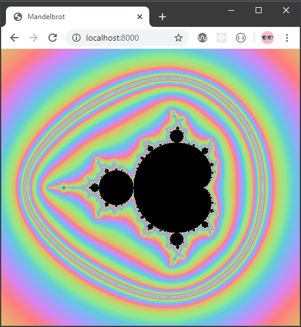

# Mandelbrot (TS)

Works in Google Chrome, but not Firefox since they haven't implemented
ES Modules for dedicated workers.

## Setup

Run `npm install` to install. 

Either run `npm run build` and `npm run start`, or `npm run dev`.

## Screenshot

